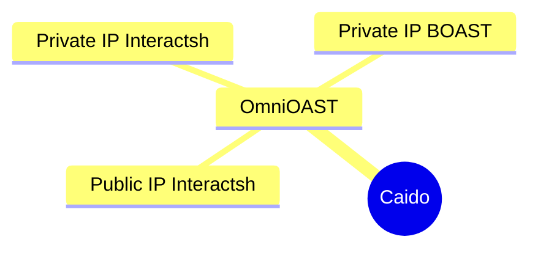

---

OmniOAST is the all-in-one [Caido](https://caido.io) plugin for managing all your OAST providers and Interactions. It's designed to streamline workflows for security professionals by efficiently handling multiple OAST (Out-of-Band Application Security Testing) providers.



## Installation

Download the latest package from the [Releases page](https://github.com/hahwul/OmniOAST/releases) and install it in Caido via the `Plugins` > `Install Package` menu. OmniOAST will be available on the official marketplace in the future.

## Dev

### Build

To build the project from the source, follow these steps:

```bash
git clone https://github.com/hahwul/OmniOAST
cd OmniOAST
```

```bash
pnpm install
pnpm build

# ./dist/plugin_package.zip
```

### Type Check

Run the following command to type-check the codebase:

```bash
pnpm typecheck
```

---

## Inspiration

OmniOAST was inspired by tools like [QuickSSRF (Caido Plugin)](https://github.com/caido-community/quickssrf) and [OAST Support (ZAP Add-on)](https://www.zaproxy.org/docs/desktop/addons/oast-support/).
