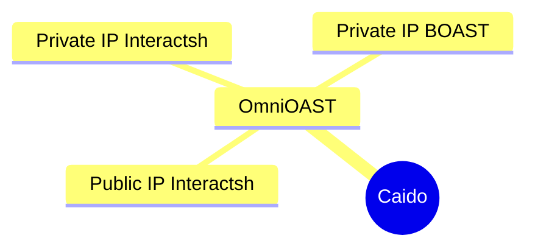

---

# OmniOAST

The all-in-one Caido plugin for managing allCaido plugin for managing all your OAST providers. OmniOAST is designed for scenarios where multiple OAST (Out-of-Band Application Security Testing) providers need to be utilized efficiently, streamlining workflows for security professionals.



## Installation

...

## Dev

### Build

Follow these steps to set up and build the project:

```bash
git clone https://github.com/hahwul/OmniOAST
cd OmniOAST
```

```bash
pnpm install
pnpm build

# ./dist/plugin_package.zip
```

### Type Check

Ensure the codebase meets TypeScript standards by running the type check command.

```bash
pnpm typecheck
```

---

## Inspiration

OmniOAST is inspired by tools like [QuickSSRF (Caido Plugin)](https://github.com/caido-community/quickssrf) and [OAST Support (ZAP Add-on)](https://www.zaproxy.org/docs/desktop/addons/oast-support/).
