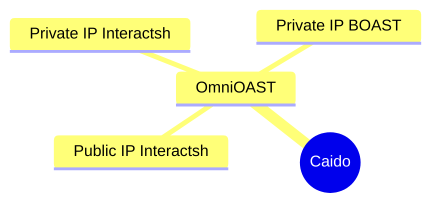

---

OmniOAST is the all-in-one [Caido](https://caido.io) plugin for managing all your OAST providers and Interactions. It's designed to streamline workflows for security professionals by efficiently handling multiple OAST (Out-of-Band Application Security Testing) providers.




## Installation

Download the latest package from the [Releases page](https://github.com/hahwul/OmniOAST/releases) and install it in Caido via the `Plugins` > `Install Package` menu. OmniOAST will be available on the official marketplace in the future.

## Usage

### 1. Managing Providers

Navigate to the **Provider** tab to create and manage OAST providers:

- Create a new provider by entering:
  - **Name**: A unique identifier for your provider
  - **Type**: Select the provider type (Interactsh, BOAST, etc.)
  - **URL**: The provider's URL endpoint
  - **Token**: Authentication token (if required)

For convenience, you can quickly add pre-configured public providers using:
- **Add Public BOAST Provider** button
- **Add Public Interactsh Provider** button

### 2. Working with Payloads and Interactions

In the **OAST** tab, you can:

- **Generate Payloads**: Select a provider from the dropdown to create custom OAST payloads
- **Monitor Interactions**: View all interactions received from your OAST providers
  - Search for specific interactions using the search functionality
  - Filter interactions by provider
  - Track detailed information for each interaction

### 3. Configuration Settings

Access the **Settings** tab to customize:

- **Polling Interval**: Adjust how frequently OmniOAST checks for new interactions
- **Payload Prefix**: Configure custom prefixes for your generated payloads


## Dev

### Build

To build the project from the source, follow these steps:

```bash
git clone https://github.com/hahwul/OmniOAST
cd OmniOAST
```

```bash
pnpm install
pnpm build

# ./dist/plugin_package.zip
```

### Type Check

Run the following command to type-check the codebase:

```bash
pnpm typecheck
```

---

## Inspiration

OmniOAST was inspired by tools like [QuickSSRF (Caido Plugin)](https://github.com/caido-community/quickssrf) and [OAST Support (ZAP Add-on)](https://www.zaproxy.org/docs/desktop/addons/oast-support/).
