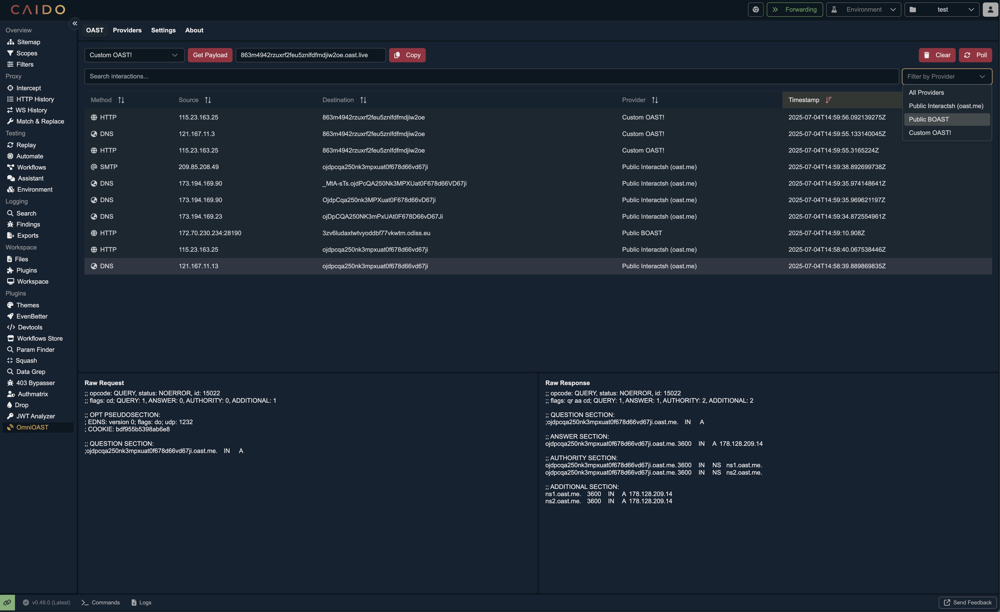

<p align="center">
<a href="https://github.com/hahwul/OmniOAST/blob/main/CONTRIBUTING.md">
</a>
<a href="https://github.com/hahwul/OmniOAST/releases">
</a>
<a href="https://caido.io">
</a>
</p>

OmniOAST is a [Caido](https://caido.io) plugin designed to streamline your Out-of-Band Application Security Testing by centralizing all provider management and interaction logs. It eliminates the need to switch between different tools by allowing you to manage various providers, from public services to private servers, and view all their callbacks in a single, unified interface directly within Caido.



## Features

- **Centralized Management**: Manage public (Interact.sh, BOAST) and private OAST providers from a single interface.
- **Unified Interaction Log**: View, search, and filter all OAST callbacks in one place, directly within Caido.
- **Streamlined Workflow**: Generate payloads and monitor interactions without switching between tools.
- **Flexible Configuration**: Supports public and self-hosted providers like Interactsh and BOAST.

## Installation

1.  Download the latest `plugin_package.zip` from the [Releases page](https://github.com/hahwul/OmniOAST/releases).
2.  In Caido, navigate to the `Plugins` page and install the package.

*We hope to see you on the Caido Plugin Marketplace!*

## Usage

1.  **Add a Provider**:
    - Go to the **Provider** tab.
    - Use the quick-add buttons for public Interactsh or BOAST servers.
    - To add a private provider, specify its name, type (Interactsh/BOAST), URL, and an optional token.

2.  **Generate Payloads & Monitor Interactions**:
    - Go to the **OAST** tab.
    - Select a provider from the dropdown to generate a new payload.
    - All interactions from your providers will appear in this tab in real-time. You can search and filter the results.

3.  **Settings**:
    - Navigate to the **Settings** tab to customize the polling interval for fetching interactions.

## Development

### Build from Source

To build the plugin from the source code:

```bash
git clone [https://github.com/hahwul/OmniOAST](https://github.com/hahwul/OmniOAST)
cd OmniOAST
pnpm install
pnpm build
```

The packaged plugin will be available at `./dist/plugin_package.zip`.

### Type Check

Run the following command to type-check the codebase:

```bash
pnpm typecheck
```

## Contributing

OmniOAST is open-source project and made it with ❤️ if you want contribute this project, please see [CONTRIBUTING.md](./CONTRIBUTING.md) and Pull-Request with cool your contents.

---

## Inspiration

OmniOAST was inspired by tools like [QuickSSRF (Caido Plugin)](https://github.com/caido-community/quickssrf) and [OAST Support (ZAP Add-on)](https://www.zaproxy.org/docs/desktop/addons/oast-support/).
