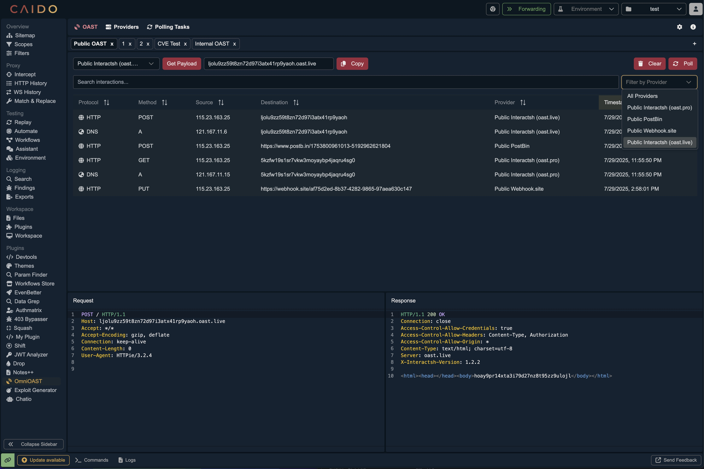

<p align="center">
<a href="https://github.com/hahwul/OmniOAST/blob/main/CONTRIBUTING.md">
</a>
<a href="https://github.com/hahwul/OmniOAST/releases">
</a>
<a href="https://caido.io">
</a>
</p>

OmniOAST is a [Caido](https://caido.io) plugin designed to streamline your Out-of-Band Application Security Testing by centralizing all provider management and interaction logs. It eliminates the need to switch between different tools by allowing you to manage various providers, from public services to private servers, and view all their callbacks in a single, unified interface directly within Caido.



## Features

- **Centralized Management**: Manage public (Interact.sh, BOAST, Webhook.site, PostBin) and private OAST providers from a single interface.
- **Unified Interaction Log**: View, search, and filter all OAST callbacks in one place, directly within Caido.
- **Streamlined Workflow**: Generate payloads and monitor interactions without switching between tools.
- **Flexible Configuration**: Supports public and self-hosted providers like Interactsh, BOAST, Webhook.site, and PostBin.
- **Tab-based Management**: Manage interactions and polling on a per-tab basis, allowing you to separate OAST activities according to your testing objectives.
- **State Persistence**: OAST links and polling tasks persist across Caido restarts, so you never lose your testing progress.

## Getting Started ⚡️

### From the Community Store (Recommended)

Getting OmniOAST up and running is a breeze.

1.  Head over to the **Plugins** page in Caido.
2.  Open the **Community Store**.
3.  Type **"OmniOAST"** into the search bar.
4.  Click **Install**, and you're all set! ✨

### The old-school way (Manual)

If you prefer to do things by hand, we've got you covered.

1.  Grab the latest `plugin_package.zip` from our [Releases page](https://github.com/hahwul/OmniOAST/releases).
2.  In Caido, go to the **Plugins** page.
3.  Click **Install Package** and select the file you just downloaded.

## Usage

1.  **Add a Provider**:
    - Go to the **Provider** tab.
    - Use the quick-add buttons for public Interactsh or BOAST servers.
    - For manual setup, specify the provider's name, type (Interactsh/BOAST/Webhook.site/PostBin), URL, and an optional token.
    - **Webhook.site**: Use existing webhook URLs or let the plugin auto-generate new ones.
    - **PostBin**: Auto-creates temporary bins (30-minute expiry) for quick testing.

2.  **Generate Payloads & Monitor Interactions**:
    - Go to the **OAST** tab.
    - Select a provider from the dropdown to generate a new payload.
    - All interactions from your providers will appear in this tab in real-time. You can search and filter the results.

3.  **Polling Tasks**:
    - In the **Polling** tab, you can view a list of all currently registered polling tasks.
    - This allows you to monitor which payloads are actively being checked for interactions.
    - If you no longer need to track a specific payload, you can select it from the list and click the "Remove" button to stop unnecessary polling.

4.  **Settings**:
    - Navigate to the **Settings** tab to customize:
      - **Polling interval**: How frequently the plugin checks for new interactions (in seconds).
      - **Payload prefix**: Optional prefix to add to generated payloads.
      - **Persist State**: Enable to preserve OAST links and polling tasks after Caido restarts (enabled by default).

## Development

### Build from Source

To build the plugin from the source code:

```bash
git clone https://github.com/hahwul/OmniOAST
cd OmniOAST
pnpm install
pnpm build
```

The packaged plugin will be available at `./dist/plugin_package.zip`.

### Type Check

Run the following command to type-check the codebase:

```bash
pnpm typecheck
```

## Contributing

OmniOAST is open-source project and made it with ❤️ if you want contribute this project, please see [CONTRIBUTING.md](./CONTRIBUTING.md) and Pull-Request with cool your contents.


---

## Inspiration

OmniOAST was inspired by tools like [QuickSSRF (Caido Plugin)](https://github.com/caido-community/quickssrf) and [OAST Support (ZAP Add-on)](https://www.zaproxy.org/docs/desktop/addons/oast-support/).
